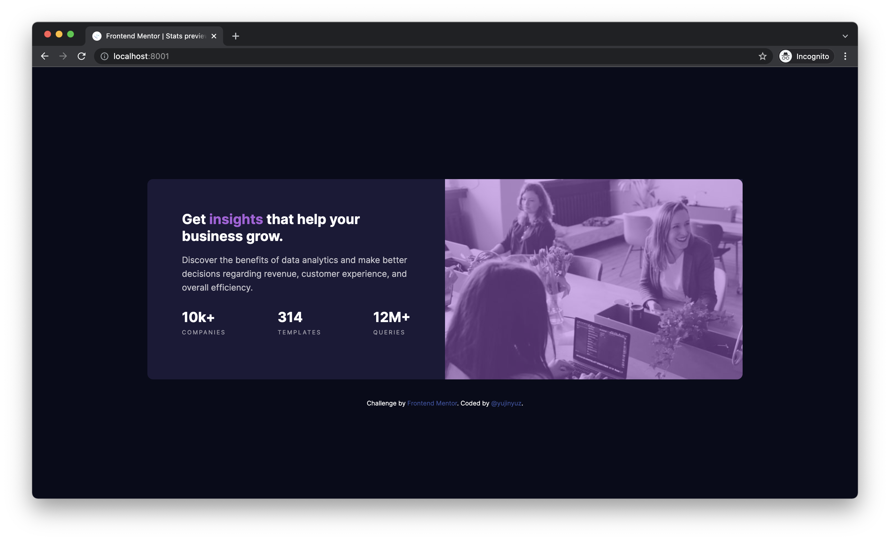

# Frontend Mentor - Stats preview card component solution

This is a solution to the [Stats preview card component challenge on Frontend Mentor](https://www.frontendmentor.io/challenges/stats-preview-card-component-8JqbgoU62). Frontend Mentor challenges help you improve your coding skills by building realistic projects.

## Table of contents

- [Overview](#overview)
  - [The challenge](#the-challenge)
  - [Screenshot](#screenshot)
  - [Links](#links)
- [My process](#my-process)
  - [Built with](#built-with)
  - [What I learned](#what-i-learned)
  - [Continued development](#continued-development)
  - [Useful resources](#useful-resources)
- [Author](#author)
- [Acknowledgments](#acknowledgments)

**Note: Delete this note and update the table of contents based on what sections you keep.**

## Overview

### The challenge

Users should be able to:

- View the optimal layout depending on their device's screen size

### Screenshot

### Links

- Solution URL:
- Live Site URL: [Add live site URL here](https://your-live-site-url.com)

## My process

### Built with

- Semantic HTML5 markup
- CSS custom properties
- Flexbox
- CSS Grid
- Mobile-first workflow

### What I learned

It's really better to approach this with mobile first since it's much easier to add media query
overrides for desktop.

I also learned that you need to add height to html and body in order for `height: 100%` to work.
Because it takes the height from the parent node. I'm not quite sure if there are other approaches
that are better but still, this one kinda works for me and I'm okay with it.

## Author

- Website - [jinyuz.me](https://jinyuz.me)
- Frontend Mentor - [@yujinyuz](https://www.frontendmentor.io/profile/yujinyuz)
- Twitter - [@yujinyuz](https://www.twitter.com/yujinyuz_)

## Acknowledgments

https://www.internetingishard.com/html-and-css/
